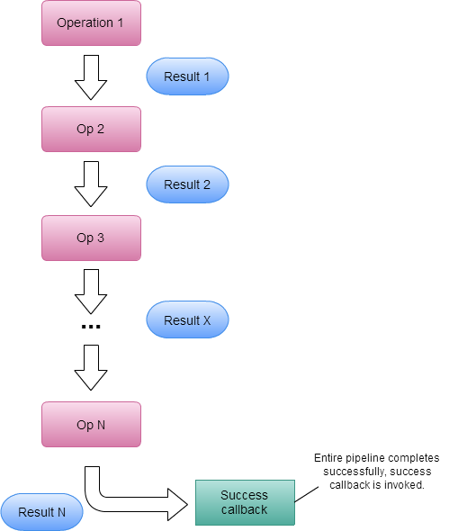
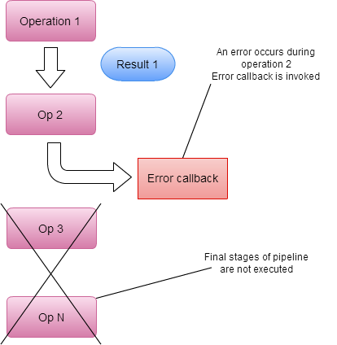

# Promises for Game Development #

First published at: [https://www.what-could-possibly-go-wrong.com/promises-for-game-development/](https://www.what-could-possibly-go-wrong.com/promises-for-game-development/)

Please use the [github page](https://github.com/ashleydavis/promises-for-game-development) to log issues and give feedback.

## Introduction ##

In this article we talk about our experience making the [promises pattern](http://en.wikipedia.org/wiki/Futures_and_promises) work for game development. We aim to explain how promises can improve your game development process.

This isn't a beginner level article. You'll need a basic to intermediate level understanding of C#. It will help if you have already tried game development and know the struggle to scale up from smaller to larger games. You should already understand how difficult it can be to manage chains of asynchronous operations and complex webs of interdependent and time-sequenced game logic. You are looking for a better way to structure this kind of code. If this is where you find yourself, then this article will give you a new option.

In this article we will spend some time introducing promises and generally explaining how they can be useful in game development. Then we'll get more specific about how promises can be applied to game development. This leads into a discussion about how we have extended the promises pattern to cope with more advanced game development problems: composing game logic from smaller units, sequencing time-based logic and structuring conditionally gated logic. We finish by comparing promises to the other alternatives you may have used or be considering.    

As you read this article keep in mind that we will never assert that promises are right for every situation. They certainly aren't the only tool you'll ever need in game development. Promises are a powerful tool for structuring complex asynchronous code and at first you might find they are difficult to appreciate. In a world where asynchronous code is becoming more and more prevalent we need patterns like this to help tame the ever-increasing complexity in our code.

At Real Serious Games we use C# with Unity. If you intend to use promises with C# (combined with any C# game engine, not just Unity) you can get started straight away using our promises library. If you intend to use promises with Javascript you have plenty of good libraries at your disposal and the latest version of Javascript even includes promises. If you work with other languages, these techniques can still work for you, but you’ll have some work ahead to get started if you can’t find an existing promises library.

Our C# promises library is available on github: [https://github.com/Real-Serious-Games/c-sharp-promise](https://github.com/Real-Serious-Games/c-sharp-promise).

A Unity example showing promises can also be found on github: [https://github.com/adamsingle/PromisesUnityDemo](https://github.com/adamsingle/PromisesUnityDemo)

## Contents

- [Introduction to Promises](#introduction-to-promises)
- [Promises for Game Development](#promises-for-game-development)
- [Promises to the Rescue in C#](#promises-to-the-rescue-in-c)
- [Promises to the Rescue in Game Dev](#promises-to-the-rescue-in-game-dev)
- [Promises for Composing Game Logic](#promises-for-composing-game-logic)
- [Promises for Time-based Logic](#promises-for-time-based-logic)
- [Promises for Conditional Gating](#promises-for-conditional-gating)
- [Promises vs Unity Coroutines](#promises-vs-unity-coroutines)
- [Almost Behaviour Trees?](#almost-behaviour-trees)
- [Conclusion](#conclusion)
- [About the Authors](#about-the-authors)

## Introduction to Promises ##

Promises are a [design pattern](http://en.wikipedia.org/wiki/Software_design_pattern) to structure asynchronous code and smooth over the complexities of running sequences of (dependent) asynchronous operations. 

I read an [article](https://blog.domenic.me/youre-missing-the-point-of-promises/) recently that helped me concisely understand exactly how promises help us. Normally when running an asynchronous function there is no easy way to get a result back. In addition we have the difficulties of handling errors and exceptions. What exactly will happen if the async code throws an exception? As so eloquently put in that article *the point of promises is to give us back [functional composition](http://en.wikipedia.org/wiki/Function_composition_(computer_science)) and [error bubbling](http://en.wikipedia.org/wiki/Exception_handling) in the async world*.

A promise is a [software abstraction](http://en.wikipedia.org/wiki/Abstraction_(computer_science)) that can bind together multiple asynchronous operations into a single *[pipeline](http://en.wikipedia.org/wiki/Pipeline_(software))* represented as a *[first-class object](http://stackoverflow.com/questions/705173/what-is-meant-by-first-class-object)*. A contract is made with the promise that at some time in the future the async operation(s) will either complete successfully or have been rejected (indicating that an error occurred at some stage of the pipeline). 

Results from each async operation are passed through the pipeline. This allows us to easily retrieve and act on results from our async code. When the pipeline has completed successfully our *success callback* will be invoked.

Promises have a powerful error handling mechanism (conceptually similar to [exception handling](http://en.wikipedia.org/wiki/Exception_handling)) that allows error handlers to be injected at any stage of the pipeline. If you are only interested in the success or failure of the entire sequence of async operations, then put your error handling at the end of the pipeline. If an error occurs at any stage of the pipeline, the rest of the pipeline stages will be short-circuited and control transferred to the error handler. This gives the equivalent of try/catch exception handling with respect to our async code. 

We first noticed promises through our experience developing web applications in Javascript. Just so we're clear here, I'm talking about real Javascript, not [Unity pseudo-Javascript](http://wiki.unity3d.com/index.php?title=UnityScript_versus_JavaScript). From reading [the wikipedia page](http://en.wikipedia.org/wiki/Futures_and_promises) it appears promises migrated to Javascript from [functional languages](http://en.wikipedia.org/wiki/Functional_programming), where so many good ideas originate.

Promises in Javascript are often lauded as the cure for the antipattern known as [callback hell](http://callbackhell.com/). Of course there are many Javascript libraries for management of async code, however the promises pattern has risen above the herd as the solution of choice and something of a [standard](https://promisesaplus.com/).

Now for an overview of how promises can help you as a game developer...

## Promises for Game Development ##

How are games structured and how can promises improve game development?

You could argue that a game is a sequence of time-dependent activities happening one after the other, dependent on and influenced by previous activities and user input. Game or level completion happens when the player satisfies a set of objectives. Objectives depend on activities and prior objectives. If you can imagine looking at it from a 4-dimensional perspective, a game looks like an interwoven tapestry of objectives and activities with complex dependencies between them.

Some of the prize tools in any game development toolbox are those that help wire together objective and activity dependencies in a manner that is elegant, expressive and easy to change as the game is evolved. Of course we already have many patterns at our disposal for structuring game code: the [strategy pattern](http://en.wikipedia.org/wiki/Strategy_pattern), [finite state machines](http://en.wikipedia.org/wiki/Finite-state_machine) (fsms), hierarchical fsms, [behavior trees](http://www.gamasutra.com/blogs/ChrisSimpson/20140717/221339/Behavior_trees_for_AI_How_they_work.php), scripting, coroutines, messaging/event systems, entity component systems and probably more. All are worth understanding.

We'd like to show that promises belong in this mix. They are a simple alternative, very useful for a great variety of tasks and you can probably start using them straight away. The power of promises comes from the ability to treat a sequence of activities as a single entity. This is the base of reuse with promises, you can create bigger and bigger building blocks from which to compose a variety of game logic and behaviour. The resulting code is readable, understandable and maintainable.

Promises are already immediately useful for many traditionally asynchronous operations such as loading assets. We also use them for sequencing movements, animations and sound into sequences you might easily call a cutscene. But for some of the more complex logic we had to  upgrade the promises pattern. Before we get to that, let's cover the more basic use of promises in C#.

## Promises to the Rescue in C# ##

At [Real Serious Games](https://github.com/real-serious-games/) we translated the promises pattern to C# and it immediately enabled a design improvement in our async code for tasks such as loading assets. In these cases it is typically preferred [to load asynchronously rather than to block](http://en.wikipedia.org/wiki/Asynchronous_I/O) and get a callback when the load has completed. This frees up the thread for other processing or simply just for keeping the UI responsive.

Let's work through some examples so you'll understand the basics of promises.

An async operation is usually started by a function that returns a promise, so let's start with such a function:

    public IPromise<MyAsset> LoadAsset(string assetPath)
    {
        // ...
    }

*LoadAsset* initiates a promise-based async operation: 

    var promise = new Promise<MyAsset>();

    // ... start the async operation ...

    return promise;

The async operation is started before returning the promise. The caller can immediately use the returned promise (via its *[fluent API](http://en.wikipedia.org/wiki/Fluent_interface)*) even though the asynchronous operation is still in flight and has not yet completed.

Upon completion of the async operation, in *whatever way* that notification actually occurs, *LoadAsset* resolves the promise:

    promise.Resolve(theLoadedAsset);

Resolving the promise triggers a pipeline of downstream callbacks that have been defined by the caller using functions such as *Then*, *ThenAll* and *Done*.

The simplest pipeline simply uses *Done* to attach a callback as the last stage of the pipeline: 

    LoadAsset(someAssetPath)
        .Done(myAsset => OnAssetLoaded(myAsset));

Multiple operations can be chained using *Then*, for example loading a linked asset:

    LoadAsset(someAssetPath)
        .Then(myAsset => LoadAsset(myAsset.LinkedAssetPath))
        .Done(nextAsset => OnAssetLoaded(nextAsset));

The [anonymous function](http://www.codeproject.com/Tips/298963/Understand-Lambda-Expressions-in-minutes) that defines the callback at each pipeline stage is invoked only after the preceding stage has resolved. Each pipeline stage returns a new promise that represents a new async operation which must complete before the pipeline can continue to the next stage (or the final stage as specified by *Done* in this case).  

This is a trivial example, but hopefully you are starting to see the power of promises.

Let's up the ante. For the RSG Promise library we have added a new function that allows multiple dependent promises to be chained. This example uses *ThenAll* to load multiple linked assets:

    LoadAsset(someAssetPath)
        .ThenAll(myAsset => 
			myAsset.LinkedAssets.Select(path => LoadAsset(path))
		)
        .Done(linkedAssets => OnAllAssetsLoaded());

*ThenAll* is passed a callback that returns an [*collection*](https://msdn.microsoft.com/en-us/LIBRary/9eekhta0(v=vs.90).aspx) of promises. All of these promises must complete before the pipeline continues. [LINQ](http://spin.atomicobject.com/2013/11/18/linq-functional-c/) *[Select](https://msdn.microsoft.com/en-us/library/system.linq.enumerable.select(v=vs.100).aspx)* transforms the *collection of linked assets* into a *collection of promises* to load those assets. As C# programmers we prefer LINQ's [*method syntax* over its *query syntax*](https://msdn.microsoft.com/en-us/library/bb397947.aspx).  

The great thing about promises is just how easy it is to manage chained sequences of async operations. Need to insert a new operation into your pipeline? The pipeline is easily modified:

    LoadAsset(someAssetPath)
        .ThenAll(myAsset => 
			myAsset.LinkedAssets.Select(path => LoadAsset(path))
		)
        .Then(linkedAssets => SomeOtherAsyncOperation(linkedAssets))
        .Then(somethingElse => AndAnotherAsyncOperation(somethingElse))
        .Done(somethingElseAgain => OnAllAssetsLoaded(somethingElseAgain));

The C# promises library and documentation [is available on github](https://github.com/Real-Serious-Games/C-Sharp-Promise).  

## Promises to the Rescue in Game Dev

There are many situations in game development that require waiting for some async operation to complete or for some condition to be fulfilled. Here are some examples:

- Downloading files or data from a network
- Playing a particle effect at the end of an animation
- Playing a sound effect at the end of an animation
- Moving a camera to a certain position
- Waiting for the player to die
- Waiting for the player to lose all their lives
- Waiting for user input
- Waiting for a timer to run out
- Waiting for all requirements of an achievement to be met

In the following sections we will work through examples (from basic to more advanced) of promises used specifically for game development.

### Promises for Asynchronous Asset Loading

Games often need asynchronous operations. Either for loading and initialisation or for runtime operations that execute over multiple frames.  

At startup a level and other assets must be loaded. Maybe data is pulled from a database in the cloud. Initialisation of other systems may depend on the loading of this data. 

A naive attempt might be frequent polling to see if the loading has completed:

    public void Update(float deltaTime)
    {
        if (!gameLoaded)
        {
            if (gameLoadFinished)
            {
                // Loading has finished.
                gameLoaded = true;            
                // Initialize systems...
            }
            else 
            {
                // Not loaded yet, maybe progress the loading screen animation.
                return;
            }
        }
        else 
        {
            // Game is loaded...
            // Update AI, world, etc.
        }
    }

Now polling can be useful but it is often [considered a bad practice](http://stackoverflow.com/questions/320284/what-is-wrong-with-polling). And you see that it is clunky and inelegant. 

This style of coding gets complicated quickly as initialisation dependencies are added. Not to mention the other issues we really should be considering. How do we handle and recover from failure? Do we poll yet another variable that indicates an error condition? 

Polling like this brings to mind the *pull model* of computing in which we *ask* objects about state changes. [According to Lee Campbell](http://www.introtorx.com/content/v1.0.10621.0/01_WhyRx.html) the world has already moved to the *push model*, but us developers are still catching up. In the push model we are *notified* of state changes instead of having to *ask*.

You are already in the *push model* realm if you are using [C# events](https://msdn.microsoft.com/en-us/library/edzehd2t(v=vs.110).aspx). Something like this:

    public void Startup()
    {
        // No need to poll, this event will notify 
		// when the level has been loaded. 
        levelLoader.LevelLoaded += levelLoader_LevelLoaded; 
        levelLoader.Load("SomeLevel");            
    } 

    private void levelLoader_LevelLoaded(object sender, LevelLoadedEventArgs e)
    {
        // Initialize dependent systems...
    }

C# events are better but the code can still get complicated very quickly. Imagine having a spider web of asynchronous dependencies that must be resolved before your game starts. How far can you go with C# events? Again, the confusion rises sharply as the complexity increases and the code becomes more difficult to manage and maintain.

Moving on from events we can use [callbacks](http://stackoverflow.com/questions/2139812/what-is-a-callback) (with anonymous methods) [instead of events](http://stackoverflow.com/questions/2020381/when-to-use-callbacks-instead-of-events-in-c), a technique that is ubiquitous in Javascript and [Lua](http://en.wikipedia.org/wiki/Lua_(programming_language)):

    public void Startup()
    {
        levelLoader.Load("SomeLevel", loadedLevel =>
        {
            // Initialize dependent systems...
        });
    }

You can get a lot of mileage out of callbacks. They better allow for a chain of loading and initialization:

    public void Startup()
    {
        // Load the level.
        levelLoader.Load("SomeLevel", loadedLevel => 
        {
            // After level has loaded, load behaviours required by the level.
            behaviorLoader.LoadBehaviors(loadedLevel.RequiredBehaviours, 
				loadedBehaviors =>
            	{
                	// Initialise dependent systems...
            	}
			);
        });
    }

The problem with callbacks is that they lead to deep nesting of anonymous functions and much resulting confusion. This is a problem so prevalent that is has been given the name [callback hell](http://callbackhell.com/).   

So this is where we arrive at promises. You need a better tool to structure and manage your complex asynchronous code. If you can appreciate the problems described already in this article, then promises are going to be a welcome addition to your toolbox.

The methods presented above can very quickly turn into a tangled web of code that is difficult to debug, test and maintain. Using Promises you can layout your chain of dependencies in an elegant and readable manner: 

    levelLoader.LoadLevel("SomeLevel")
        .Then(loadedLevel => LoadSomethingElse(loadedLevel))
        .Then(loadedLevel => LoadAnotherThing(loadedLevel)))
        .Done(loadedLevel => StartGame(loadedLevel));

I'm sure you can agree that promises make this sort of thing much more understandable, not to mention easy to modify.

Another nice thing about promises: gradually refactoring of your code is possible to convert to promises. We know because we did this, incrementally replacing Unity coroutines with promises (and testing very carefully at each stage).

This is really just a taster of what promises can do. We need to explore them in more depth so you'll understand how transformative they can be for your development process.    

### Promises for Composing Game Logic 

Promises have a powerful ability to compose sequences of operations via the fluent API. We have extended the promises specification by adding composition operators to solve problems specific to game development. In this section we will look at these new operators. *All* for composing parallel operations, *Race* for completing when the first parallel operation completes and *Sequence* for scheduling a collection of sequential operations.  

#### Promise.All

*All* packages up multiple promises, the resulting promise resolves only when all of the packaged promises have resolved.

This can be very useful in a number of situations. For example an achievement system. Imagine a puzzle game with an achievement that is unlocked after the player has played the game for 20 minutes and finished 10 levels in that time:

    IPromise OpeningGambitAchievement()
    {
        return Promise.All(
            WaitForTimeSpentOnPuzzles(60 * 20),
            FinishedSpecificNumberOfLevels(10)
        );
    } 

*WaitForTimeSpentOnPuzzles* and *FinishedSpecificNumberOfLevels* are both functions that return promises. What they are doing internally will be explained later, for now it is important to understand that the promise returned by *OpeningGambitAchievement* will resolve when *both* of the inner promises have resolved, regardless of how far apart those two events occur.

To use this promise, you simply fire and forget:

    OpeningGambitAchievement()
        .Done(() => ShowAchievementNotification("OpeningGambit");

*All* can also take a collection of promises to resolve, e.g. a collection of objectives the player must complete:

    IEnumerable<IPromise> ObjectivesToComplete()
    {
        // ... return a collection of promises ...
    }

It is now easy to receive a notification when the player has completed the objectives:

    Promise.All(ObjectivesToComplete())
        .Done(() => OnObjectivesCompleted()); 

*All* can be used within a chain via *ThenAll*:

	LoadLevel(someLevel)
		.ThenAll(theLevel => ObjectivesToComplete(theLevel))
		.Done(() => OnLevelCompleted());

#### Promise.Race

*Race* is similar to *All*, but it resolves immediately when the first inner promise resolves. Each of the promises are *racing* each other for completion. This allows us to easily build timeouts into our code. 

Imagine a situation where the user needs to provide some input, but there is a time limit on their opportunity to do so. In this example the returned promise resolves either on input from the player or after the timeout has expired, whichever comes first: 

    IPromise WaitForTimedUserInput(float timeoutSeconds)
    {
        return Promise.Race(WaitForInput(), Timeout(timeoutSeconds));
    }

Be warned that the other inner promises will continue running until they complete. Although the *Race* promise resolves and invokes chained logic as soon as the first promise completes, the other promises will continue to run until completion. So be careful using promises that are making asynchronous state changes and causing side effects.

*Race* can be used within a chain via *ThenRace*.

#### Promise.Sequence

Some scenarios, for example animating a dynamically generated sequence of movements, can be simplified using the *Sequence* function. You may have a hard-coded sequence of operations: 

    PromiseOne()
        .Then(PromiseTwo())
        .Then(PromiseThree())
        .Then(PromiseFour())
        // ... etc ...
        .Done();

*Sequence* is needed to change this to a dynamically generated collection of operations (possibly loaded from data).

*Sequence* is given a collection of functions, each returning a promise. Each function is invoked in-turn one after the other, but only after the previous promise has resolved. This enables a sequence of asynchronous operations to be executed serially:

    IEnumerable<Func<IPromise>> GenerateMovementSequence()
    {
        // Generate a collection of functions that each initiate an async operation 
        // and returns a promise. 
    }     

    Promise.Sequence(GenerateMovementSequence())
        .Done(() =>
        {
            // The sequence has completed.
        });

This sounds more complicated than it actually is. We need a collection of functions, rather than a collection of promises, since we need to hold off starting each async operation until its turn arrives. We can't simply pass in a collection of promises, as already having a promise implies that the async operation has already started, meaning that every operation in the sequence would start at the same time and this is not what we want (this is what *All* does). So *Sequence* must take functions that are yet to be called.

As an example, let's say we have an NPC guard who follows a series of waypoints. When the behaviour is completed the NPC is reset to later be triggered again by the player. 

We could use promises in the way mentioned above, chaining together *Then*s to build a sequence that moves the NPC over time through each of the waypoints. This means we need to know the waypoints at compile time. We’d like to make this data driven, loading the set of waypoints from data. This is a perfect opportunity for *Sequence*.

Let's assume we have  a function for moving our NPC that returns a promise. The promise resolves when the NPC has moved into position:

    IPromise MoveToPosition(Vector3 endPosition, float movementSpeed);     

This would be enough for us to manually chain it. But to use *Sequence* we need to return a function that returns a promise, allowing *Sequence* to call it at the right time:

    Func<IPromise> PrepMoveToPosition(Vector3 endPosition, float movementSpeed)
    {
        return () => MoveToPosition(endPosition, movementSpeed);
    }

*PrepMoveToPosition* wraps *MoveToPosition* in an anonymous function and returns the new function. This allows us to build a collection of such functions to pass to *Sequence*:

    Vector3[] waypoints = ... loaded from data ...    

    void MoveAlongWaypoints(float movementSpeed)
    {
        // Generate collection of functions for moving through the way points.
        var moves = waypoints
            .Select(waypoint => PrepMoveToPosition(waypoint, movementSpeed);

        Promise.Sequence(moves)
            .Done(() => Reset()) // Reset the NPC ready to be triggered again.
    }

You can see how promises not only enable, but encourage us to separate our logic, breaking our functions down to tight, logical components that are easy to read and manage.

*Sequence* can be used within a chain via *ThenSequence*

### Promises for time based logic ##

Using promises in the above scenarios has clear benefits, however they really hit their full potential when we extend promises to factor in time.

Most game developers will have used a timer in some way, tracking time is a necessary and important part of game development. Examples include power ups that last for a limited amount of time, end conditions based on time taken, time per lap in a racing game and at the top end of complexity, entire cutscenes that are sequences of many timed operations. 

In it's simplest form a timer is used to trigger logic after a certain amount of time has passed. Once-off, this is a simple problem to solve in code. It’s a floating point value that is incremented by [delta elapsed time](https://unity3d.com/learn/tutorials/modules/beginner/scripting/delta-time) each update:

        void Update(float deltaTime)
        {
            curTime += deltaTime;
                
            if (curTime < triggerTime)
            {
                // Still counting towards the timer
            }
            else
            {
                // Time is up
            }
		}

This is a simple technique, but scaling up complicates things. Having multiple timer running becomes hard to debug and maintain. 

Let's consider a more complicated example.

Imagine your player character is a shape changer and capable of taking on multiple forms, with each form having specific benefits. The player can only activate these forms from the human form and while changed they cannot control when they change back, which happens after a random amount of time. To further complicate this, while in each of these forms, the player can activate power-ups specific to that form, which also have their own timers.

    class Character
    {
        float currentFormTimer; // The amount of time left in the current form.

        enum Form
        {
            Human,
            Wolf,
            Hawk,
            Dolphin
        }
        Form currentForm = Form.Human;

        float currentPowerupTimer;        

        enum Powerup
        {
            None,
            Werewolf,
            HawkSpeed,
            DolphinEcho
        }
        Powerup currentPowerup = Powerup.None;
        
        public void Update(float deltaTime)
        {
            if (currentForm != Form.Human)
            {
                currentFormTimer -= deltaTime;
                
                if (currentFormTimer <= 0f)
                {
                    // Return to human form
                    currentForm = Form.Human;

                    // Disable any powerups that were active
                    currentPowerup = Powerup.None;
                }

                if (currentPowerup != Powerup.None)
                {
                    currentPowerupTimer -= deltaTime;
                    if (currentPowerupTimer <= 0f)
                    {
                        currentPowerup = Powerup.None;
                    }
                }
            }
        }
    }

This example is still simple, but well on it's way too becoming overly complicated, also ugly and difficult to read.  You can imagine how it will look as we add more features and more timers.
 
With another extension to our promises library we can improve our use of timers. This will allow us to move this logic out of *Update* and into separate functions, each with a [clearly defined responsibility](http://en.wikipedia.org/wiki/Single_responsibility_principle). 

We have implemented the *PromiseTimer* class which can bridge the gap between promises and timers. The *WaitFor* function returns a  promise that resolves after the requested time has passed:

        PromiseTimer promiseTimer = new PromiseTimer();

        promiseTimer.WaitFor(timeToWait)
            .Done(() => 
			{
				// Time is up
			});

Let’s define a convenience function within the same class:

    PromiseTimer promiseTimer = new PromiseTimer();

    IPromise WaitFor(float timeToWait)
    {
        return promiseTimer.WaitFor(timeToWait);
    }

Now somewhere our timers still must be updated. Let's do that in the *Character* class:

	void Update(float deltaTime)
	{
		promiseTimer.Update(deltaTime);
	}

Now let's rewrite the *Character* example using *WaitFor*. You'll remember the logic in the *Update*. Here we can move that out to appropriate helper functions.

    class Character
    {
        PromiseTimer promiseTimer = new PromiseTimer();
        
        enum Form
        {
            Human,
            Wolf,
            Hawk,
            Dolphin
        }
        Form currentForm = Form.Human;
   
        enum Powerup
        {
            None,
            Werewolf,
            HawkSpeed,
            DolphinEcho
        }
        Powerup currentPowerup = Powerup.None;

        public void Update(float deltaTime)
        {
            promiseTimer.Update(deltaTime);
        }

        // Activates wolf mode if possible
        public IPromise BeWolf()
        {
            if (currentForm != Form.Human)
            {
                // Resolve this promise straight away, 
				// we already have one running for a transformation.
                return Promise.Resolved(); 
            } 

            // Wait for a random time between 10 and 20 seconds
            return RunTimer(Random.Range(10f, 20f)) 
                .Then(() => currentForm = Form.Human); // Return to human mode.
        }

        ...

        // Similar functions for the other transformations

        ...

        // Activate power-up.
        public IPromise ActivateWerewolfPowerup()
        {
            if (currentForm != Form.Wolf || currentPowerup == Powerup.Werewolf)
            {
                return Promise.Resolved();
            }

            currentPowerup = Powerup.Werewolf;

            return promiseTimer.WaitFor(Random.Range(1f, 5f))
                .Then(() => currentPowerup = Powerup.Werewolf);
        }
    }

And all our timer based logic is neatly handled for us by the *PromiseTimer*.

You may have noticed the small problem with our shapechanger code! Should the *wolf form* time end before the werewolf power-up time, the power-up would remain active. We can address that easily by extending promises for conditional gating.

###  Promises for Conditional Gating

You may have already picked up on the fact that *All*, *Race* and *Sequence* are very similar to the standard programming constructs *and*, *or* and *for*. Thinking about them in this way will help you understand how they can be used to construct conditional logic and behaviour. 

The *PromiseTimer* extends on these by adding the time-based conditional operations *WaitUntil* and *WaitWhile*.

*WaitUntil* returns a promise that resolves at some future time when our custom condition has evaluated to true. This condition could be a time limit, making it perform exactly the same as *WaitFor*, or it could be any other expression that returns a boolean result.

In the last section we mentioned the logic error in the power-up function: 

    IPromise ActivateWerewolfPowerup()
    {
        if (currentForm != Form.Wolf)
        {
            return Promise.Resolved();
        }

        return promiseTimer.WaitFor(Random.Range(1f, 5f));
    }

If *currentForm* should change after the *WaitFor* has started but before it finishes, meaning our character has reverted to human form, the werewolf powerup will remain active until it's time runs out, despite the character not being in wolf form anymore. This can be fixed with *WaitUntil*:

    IPromise ActivateWerewolfPowerup()
    {
        var powerupTime = Random.Range(1f, 5f);
        return promiseTimer.WaitUntil(t =>
        {
            return t.elapsedTime >= powerupTime || currentForm != Form.Wolf);
        });
    }

Here our promise will resolve once the time has run out, or the character is not a wolf, whichever comes first.

Earlier, when talking about *Promise.All*, we talked about two promise-returning functions that were used to detect an achievement. They were *WaitForTimeSpentOnPuzzles* and *FinishedSpecificNumberOfLevels*. Both are very simple to construct using the *PromiseTimer*:

    IPromise WaitForTimeSpentOnPuzzles(float seconds)
    {
        return promiseTimer.WaitUntil(timeData => 
        {
            var timePlaying = 0f;
            if (!paused)
            {    
                timePlaying += timeData.deltaTime;
            }

            return timePlaying >= seconds;
        });
    }

    IPromise FinishedSpecificNumberOfLevels(int levelCount)
    {
        return promiseTimer.WaitUntil(_ => levelsCompleted >= levelCount);
    }

Using *WaitUntil* we can quickly and easily build complicated systems that are still manageable. For instance, let us assume our crazy shapechanger game has a whacky achievement system. It has an achievement for completing a level with 1 second left on the clock, on a Tuesday, while in dolphin form (I don't know why you'd do this, but it could be fun). I'm sure you can imagine how complicated these types of achievements can be to code. Especially if your game has 150+ of them. We can use *WaitUntil* to monitor a complex set of conditions and dynamically respond:    

    class LevelManager
    {
        DateTime timeOfLevelStart;

        Character character;
        float curTimeRemaining; // The amount of time left on the clock
        float totalLevelTime = 60f; // 1 minute to finish the level.
        PromiseTimer promiseTimer = new PromiseTimer();

        public LevelManager()
        {
            timeOfLevelStart = DateTime.Now();
            curTimeRemaining = totalLevelTime;
            
            // Timer for the level, 
			// this time counting down so we can catch that last second
            promiseTimer.WaitUntil(timeData => 
                {
                    curTimeRemaining = totalLevelTime - timeData.elapsedTime;
                    return curTimeRemaining <= 0;
                })
                .Done();

            promiseTimer.WaitUntil(_ =>
	            {
	                return 
						timeOfLevelStart.DayOfTheWeek == DayOfTheWeek.Tuesday &&
	                    character.IsInDolphinMode &&
	                    curTimeRemaining <= 1f &&
	                    curTimeRemaining > 0f; 
	            })
	            .Then(() => ShowAchievementNotification("NailedItOnDolphinDay"))
	            .Done();
        }
    }

#### Nested Promises

We have already seen examples of promises nested within other promises, now let's take a more in-depth look at using them.

Imagine we are building a game that has a tutorial at the beginning. The tutorial shows some action, then pauses while it waits for the player to interact in a specific manner before moving on. We can construct this by building a larger promise from smaller promises:

    IPromise MoveCamera(Vector3 endPosition, float durationSeconds)
    {
        var startPosition = camera.CurPosition; 
        return promiseTimer.WaitUntil(timeData =>
            {
                camera.CurPosition = Vector3.Lerp(
					startPosition, 
					endPosition, 
					timeData.elapsedTime / durationSeconds
				);

                return IsPositionCloseEnough(camera.CurPosition, endPosition); 
            });
    } 

OK so nothing new yet. Now a function that waits for player input:

    IPromise WaitForKeyInput(KeyCode key)
    {
        return promiseTimer.WaitUntil(_ => InputManager.GetKey(key));
    }

Now we sequence textual information, allowing the option of waiting for the user to press space to progress from one message to another. The boolean makes it optional because it isn't needed for the last text box in the sequence:

    Func<IPromise> PrepTextBoxesForStage(string text, bool waitForInput)
    {
        return () =>
        {
            TextBox.Text = text;
            TextBox.Show(); // Sets up the text and displays it on screen.
            if (waitForInput)
            {
                return WaitForKeyInput(KeyCode.Space);
            }

            return Promise.Resolved();
        }
    }

Now let’s build the sequence for the tutorial. We move the camera to a certain position, show 1 or more messages and wait for input:

    Func<IPromise> PrepTutorialStage(
		Vector3 cameraPosition, 
		string[] texts, 
		KeyCode key
	)
    {
        // If the index is the last one in the array, 
		// then we don't want to wait for the user's input
        var textBoxes = texts.Select(
			(text, index) => 
				PrepTextBoxesForStage(text, index != texts.length - 1)
		);
        return () =>
        {
            return MoveCamera(cameraPosition, 2f)
                .ThenSequence(() => textBoxes)
                .Then(() => WaitForKeyInput(key));
        }
    }

Next we'll assume that we have our stages described in a database or spreadsheet from which we can load a collection of *TutorialStage* structures:

    struct TutorialStage
    {
        public Vector3 Position;
        public string[] Texts;
        public KeyCode key;
    }

Finally pulling it altogether into a very small function, which returns a promise that resolves when the tutorial has completed:

    IPromise RunTutorial(IEnumerable<TutorialStage> tutorialData)
    {
        var tutorialStages = tutorialData
            .Select(data => 
				PrepTutorialStage(data.Position, data.Texts, data.key)
			);

        return Promise.Sequence(tutorialStages);
    }

Phew, now we have a sequence of tutorial steps each customised to context, able to wait for user interaction, driven by data and with each part of the process separated and isolated. For a more specific implementation of this we have set up a Unity project demonstrating it. Please feel free to pull it down and poke around the code. It can be found here [on GitHub](https://github.com/adamsingle/PromisesUnityDemo)

## Promises vs Unity Coroutines ##

Promises are an alternative to [coroutines](http://docs.unity3d.com/Manual/Coroutines.html) in Unity. Coroutines have their place in our toolbox, but we prefer promises. If you have ever used coroutines to any degree of complexity you will know that the ability to comprehend them diminishes quickly as the code gets more complex

Coroutines in Unity build on C# [iterators](https://msdn.microsoft.com/en-us/library/dscyy5s0.aspx). Unity has control here... it runs our coroutine which returns an iterator. Unity then steps that iterator forward, element by element, advancing the execution of the iterator. Each time our coroutine [yields](https://msdn.microsoft.com/en-us/library/9k7k7cf0.aspx) we give control back to Unity, in the future Unity steps the iterator forward again allowing our coroutine to progress until it yields again or finally completes.

Promises are from the Javascript world and Javascript doesn't have coroutines, although [generators](https://developer.mozilla.org/en-US/docs/Web/JavaScript/Guide/Iterators_and_Generators) are coming in [ES6](http://es6-features.org/) and people are already talking about how to do [coroutines in Javascript](http://syzygy.st/javascript-coroutines/) and the [pros](https://medium.com/code-adventures/callbacks-vs-coroutines-174f1fe66127) and [cons](http://calculist.org/blog/2011/12/14/why-coroutines-wont-work-on-the-web/) of doing so. Coroutines seem to inspire equal measures of love and hate. 

Of course we believe the use of promises results in more expressive and maintainable code than using coroutines.

However, coroutines do have one major advantage: it is much easier to read the flow of the code. This makes it easier to debug a linear sequence of code (even though overall debugging effectiveness is greatly reduced with coroutines). The only thing that gets in the way of reading the flow of the code is the frequent requirement to use *yield return ...* as opposed to *Then*, *ThenAll* and similar functions when working with promises. Both get in your way, but in coroutines it is definitely easier to read and debug over a short linear sequence of code. 

While this is the only advantage to using coroutines, there are multiple disadvantages.

It is difficult to build larger coroutines out of smaller coroutines. Nested coroutines are tough to manage, you can do it of course but at first it isn't obvious how to achieve it. Sure, it’s simple enough if you’ve done it once or twice. Try doing it 100s of times. On the other hand promises can be stitched together and nested in many ways to produce larger sequences of logic. This sort of [composability](http://en.wikipedia.org/wiki/Composability) results in better [code reuse](http://en.wikipedia.org/wiki/Reusability). You'll end up with a library of higher-level promise-returning functions for common logic that you can compose to build new behaviour creating new and different game logic. Recomposing and rewiring promises is trivial and increases your ability for fast experimentation, something that is essential to being productive while searching for the tweaks that put the fun in your game.

Another problem with coroutines is the lack of control you have over them. Unity runs coroutines automatically, you don't have any control over when and how coroutines are advanced and you have no idea what coroutines are running at any particular point. This is why coroutines are particularly hard to debug (even though debugging a single coroutine is in fact easier). This is a complete disaster for understanding what your code is doing. The only control you have over coroutines is the ability to yield from within the coroutine (thus giving control back to Unity) or you can stop one or all coroutines. 

Stopping a single coroutine has its own problems. We can only stop it by specifying the name of the coroutine as a [magic string](http://en.wikipedia.org/wiki/Magic_string) (everyone knows this is bad right?). This impacts the [type-safety](http://en.wikipedia.org/wiki/Type_safety) of our code and breaks the automated refactoring tools in Visual Studio. Single promises or a group of promises can easily be stopped by stopping the *PromiseTimer* that is responsible for them. No [magic strings](http://en.wikipedia.org/wiki/Magic_string) are necessary to achieve this.       

Using the *PromiseTimer* gives us back control. We can update promises wherever we want and (when debugging is enabled) we can display a list of the promises that are currently running. We can use multiple *PromiseTimer*s to control different groups of promises in different ways, for instance we could pause a group of promises while we allow another group to continue running. 

Want to know the major disadvantage of using coroutines? They can only be used from a [MonoBehaviour](http://docs.unity3d.com/ScriptReference/MonoBehaviour.html). If you use coroutines then your code is [tightly coupled](http://en.wikipedia.org/wiki/Coupling_(computer_programming)) to Unity and there is no chance that you'll run your code outside of it. This drastically limits opportunities for code reuse and test driven development. If you don't understand the need for this, maybe it won't be a problem for you, go ahead and use coroutines.

## Almost Behaviour Trees?

As we worked with promises and extended them for game development we started to get the feeling that we were almost reinventing [behaviour trees](http://en.wikipedia.org/wiki/Behavior_Trees_(artificial_intelligence,_robotics_and_control)).

We weren't quite building AI (what behaviour trees are for). We were building interactive game behaviour. Sequencing sound, animation, user interaction, etc. Sequencing the flow of levels and the evaluation of the conditions required to progress to the next level.

Promises (as we use them) and behaviour trees have some overlapping functionality...

With the extended promises API we can run async operations in parallel (using *All* and *ThenAll*). This is very similar to using a [*parallel node*](http://aigamedev.com/open/article/parallel/) in a behaviour tree.

We can run async operations sequentially (using *Sequence* and *ThenSequence*) and this is very similar to using a [*sequence node*](http://aigamedev.com/open/article/sequence/) in a behaviour tree.

Promises can be nested hierarchically. That is to say that promises can have nested promises and the parent promise will resolve when its child promise(s) have resolved. Behaviour trees as well can be nested, they are after all a [tree](http://en.wikipedia.org/wiki/Tree_(data_structure)), an inherently [recursive](http://en.wikipedia.org/wiki/Recursion_(computer_science)) data structure. 

Behaviour trees have a [*selector node*](http://aigamedev.com/open/article/selector/), to which there is no corresponding feature in the promises API, not that it would be difficult to add one should it be needed.

When you come to the limits of promises you may want to consider using behaviour trees, they have a number of advantages over promises... 

Behaviour trees are typically data-driven and built by game designers using an editor. This allows non-programmers to directly build, tweak and balance and is the ideal way to build game logic and AI. For indie game devs it may not be an option to use a behaviour tree editor and it may not even be an option to actually have a game designer as often the programmer will also be the game designer. In these situations code-driven game AI can work very well. We have certainly pushed promises very far already in this space and have been very happy with the result. We can however *imagine* a code-driven fluent-API for behaviour trees that would better suit us in some circumstances. 

Behaviour trees are easier to control. They are designed to be paused, stopped, restarted, etc. Promises are not designed to do these things, although we can at least pause or stop a time-based promise that is running via the *PromiseTimer*, however it is difficult if not impossible to stop a mid-flight asynchronous operation such as awaiting the result of an network transaction. It's not that we can't work around these issues with promises, but if you take promises far enough that you hit these issues, you might want to start thinking about using behaviour trees. What we’re saying is you should use promises where they are useful… and bring in behaviour trees for those areas where promises become unwieldy.

Debugging can also be much easier for behaviour trees depending on the situation. If you have the luxury of having a behaviour tree editor you may also have some kind of visual behaviour tree debugger. This is great, but of course there is no substitute for debugging real code in a real debugger to work out what is going on. Debugging promises can be difficult, but at least you get to do it in a real debugger. We imagine that our fantasy behaviour tree fluent-API is easier to debug than the promises API.

## Conclusion

Through this article we have described our experience using the promises pattern for game development. Any advanced technique has both benefits and disadvantages and you should be well informed, understand the risks and make educated decisions on which tech to bring into your development process.

Bringing the wrong technique or technology into your process can be disastrous. All things have their places, but used badly or in the wrong situation they can negatively impact your productivity, so be careful and have a plan B for when a particular technology doesn't work for you. 

Make sure you plan time to learn. You can't rush into something and expect to be effective with it immediately. You need to understand the situations where it is useful and understand how to workaround and mitigate the potential pitfalls.

Please don't let this turn you off! We just want to make sure you are aware of what you are getting yourself into. By all means jump in and explore promises and we hope this article has helped you prepare for that. Just be aware that any advanced technology can be a black hole... 

Please go to github to download the C# promises library and *PromiseTimer*: [https://github.com/Real-Serious-Games/c-sharp-promise](https://github.com/Real-Serious-Games/c-sharp-promise).

The Unity example can be found here: [https://github.com/adamsingle/PromisesUnityDemo](https://github.com/adamsingle/PromisesUnityDemo)

Thanks for reading.
Ash and Adam.

## About the Authors

### Ashley Davis

Ash is a software developer living and working in Brisbane, Australia. 

He has been developing games professionally since 1998 with a few interludes in other industries. In 2012 Ash moved into the world of serious games and simulations taking on the role of Lead Developer at Real Serious Games where he uses his experience to make game technology work for business. 

Ash is both a full time developer and a contractor under the name [*Code Capers*](www.codecapers.com.au) and is working on cloud and mobile products. 

Ash regularly contributes to the open source community and is a founder and organiser of games industry meetups in Brisbane: Game Technology Brisbane and Game Development Brisbane.

For a longer bio please see Ash's profile on [linked in](https://au.linkedin.com/in/ashleydavis75).

### Adam Single

Adam is a Husband, Father, Professional Developer, Indie Developer, lover of music and gamer. He's the coder for 7Bit Hero, a programmer on the tech team at Real Serious Games, co founder, programmer and co designer at Sly Budgie and co organiser of the Game Technology and Game Development Brisbane Meetups.

Since entering the professional game development industry in 2011, Adam has worked on numerous mobile games, including the Android hit Photon and a pre-install game designed for specific Disney Japan handsets. He's been the programmer on a team that created a huge, interactive display at Queensland University of Technology's amazing multi touch screen installation The Cube as a part of Australia's first Digital Writing Residency and worked on a team at Real Serious Games creating large scale, interactive simulations for the mining and construction industries, some of which are Virtual Reality based solutions using the Oculus Rift. All of this has been done using the Unity game engine.

Adam has a passion for the unique and engaging possibilities inherent in modern technology. When he's not working on exciting new game mechanics for Sly Budgie, he's experimenting with “home made VR” using mobile phone technology, building mobile applications utilizing modern web development technologies and pushing the exciting ideas behind 7Bit Hero's live music/multiplayer game interaction down whichever fascinating path it should happen to lead.

